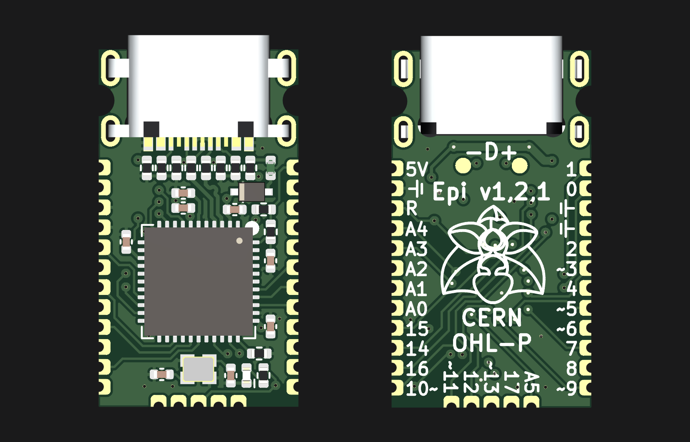

# Epi

Named after the Epipactis genus of orchids. The flower of one appears on the board.

With such "amazing" features as:

USB power and data line ESD protection.

Crenellated pins.

No integrated voltage converter, only runs at 4,5-5,5v(down to 2,7 if you make it with an 8mhz crystal, or use the internal oscillator).

USB-C connector sunk into the board, and slighly portruding from the end for panel mounting.

1,27mm pin spacing.

Extra pins broken out.

Holes where M2 bolts can be used to hold it in place.

No rx/tx/power LEDs. Only one on pin 13 for testing.

Includes some custom footprints with 3D models.

Size comparisons.

Licensed under CERN-OHL-P v2
